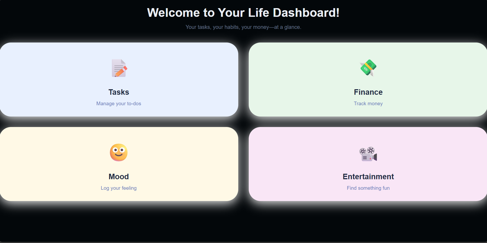
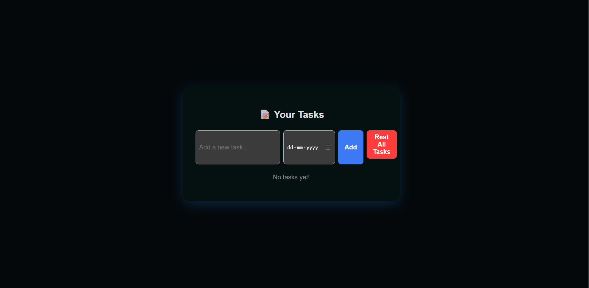
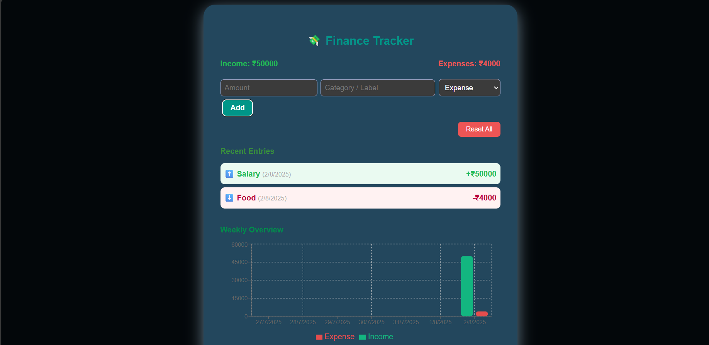
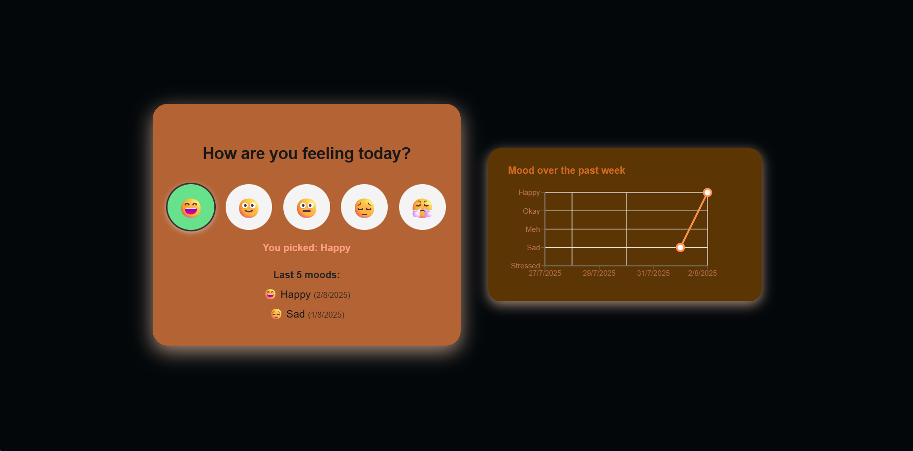
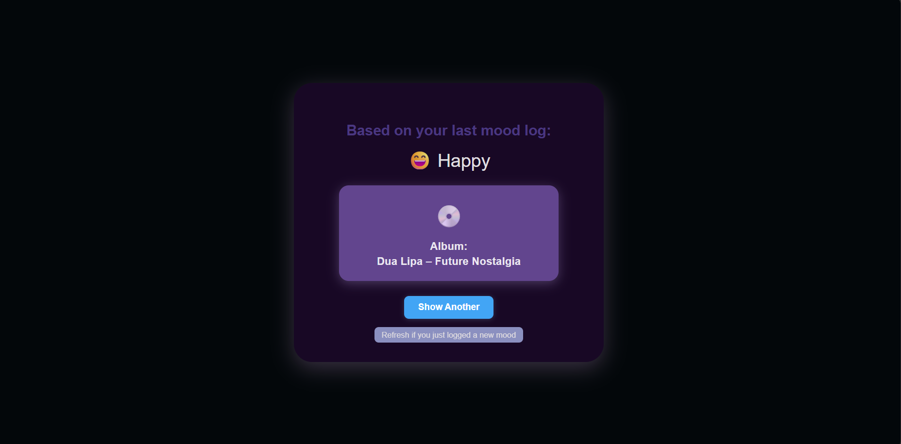

Life Dashboard
All your tasks, mood, money, and chill—one powerful, friendly dashboard!

Features
Dashboard: Clickable, 4-way nav (Tasks, Finance, Mood, Entertainment).

Tasks: Add, check when done, reset, and save tasks.

Mood Tracker: Log your feeling, see your last 7 days as a line graph, all moods persistent!

Finance Tracker: Instant add for income/expense, totals, recent history, AND a 7-day bar chart.

Entertainment: Mood-matched, smart recs for movies, music, albums.

All Data Local: Never lose your logs—everything stored in your browser

Beautiful, Responsive Design: Works great on desktop.

One-click Reset: Easy to start fresh on any page

🛠️ Tech Stack
React 19 + Vite

LocalStorage for fast, simple persistence

Recharts for mood/finance visualizations

Minimal dependencies, UI with pure React & CSS

🔥 Quick Start
bash
git clone https://github.com/SohamPadalkar/Life-Dashboard
cd life-dashboard
npm install
npm run dev
Open http://localhost:5173 to play!

🎯 Usage
Dashboard: Pick what you want to do with big, clickable cards.

Tasks: Add a task (with optional due date), complete or reset all.

Mood: Tap your mood today, watch your week’s “mood line” go up/down.

Finance: Log an expense/income (auto-color, auto-balance), see your week in bars!

Entertainment: Get a fresh rec based on your last mood—no more “what should I watch/listen?”

🌟 Screenshots

📦 Folder Structure
text
src/
  App.jsx
  DashboardPage.jsx
  TasksPage.jsx
  MoodPage.jsx
  FinancePage.jsx
  EntertainmentPage.jsx
  ...
public/
  favicon.png
  index.html
📝 Credits
Built with ✨ love, React, and a little hackathon adrenaline

Mood/Finance charts: Recharts

Original idea and code: Soham Padalkar